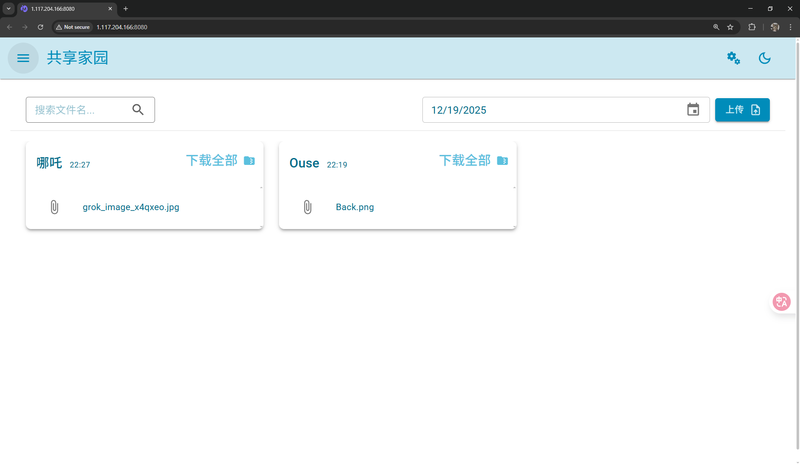
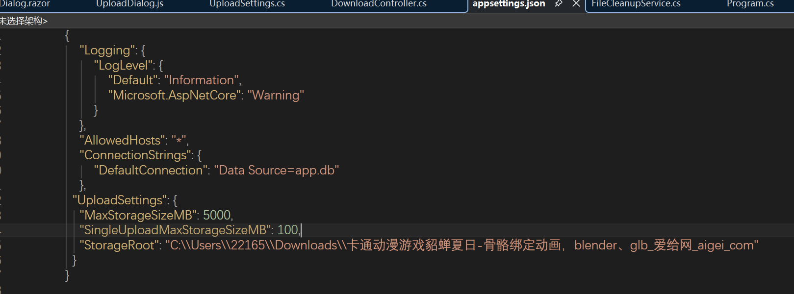

## SimpleShare
### Introduction
Hello,I am ouse,thank you for visiting this repository.It is simple a tool for resolving file transfer.    
It's built by blazor server,Database: SQLite
Screenshot as follows.  

  
### Features
1. Simple to use,just send and accept.
1. Easily limit total and per-upload sizes.
2. Easy to deploy,just download and run!.
### From Source
1. Clone this repository.
2. Open cmd or powershell,and execute dotnet restore.
3. dotnet run,open the project.
### Deploy
1. dotnet publish or download pre-built version from release in github.
1. open appsettings.json and configure according to your needs

2. execute ./SimpleFileForShare
### End
If you have any questions,just let me know(2216528769@qq.com)!